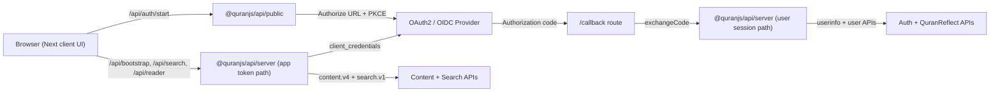

# Architecture

This page describes the included `next` template: a single Next.js App Router
project with backend-for-frontend behavior.

Other templates should preserve the same Quran Foundation integration contract:
content/search use the app-token backend path, user actions use the user-session
backend path, and browser code never receives confidential tokens or secrets.

## System Diagram

## Two Token Paths
- User token path:
  - Starts after OAuth code exchange.
  - Powers notes, bookmarks, collections, goals, preferences, and reflections.
  - Stored server-side in session storage.
- App token path:
  - Created server-side with `client_credentials`.
  - Powers content and search.
  - Independent from logged-in user state.

## Session Storage
- Default: in-process memory store (single-instance friendly).
- Production recommendation: Redis (`REDIS_URL`) for shared, multi-instance deployments.
- Browser stores only signed session cookie (`qf.sid`), never raw tokens.
- Mutating JSON routes rely on `SameSite=lax` session cookies and same-origin
  `application/json` requests. If you relax cookie `SameSite`, enable broad
  CORS, or accept form-encoded mutations, add an explicit CSRF token check.

## Route Model
- UI routes:
  - `/`, `/read/[chapterId]`, `/search`, `/library`, `/goals`, `/reflect`, `/settings`
- Auth routes:
  - `/api/auth/start`, `/callback`, `/api/auth/logout`
- Internal data routes:
  - `/api/bootstrap`, `/api/search`, `/api/reader/[chapterId]`
  - user mutations under `/api/notes`, `/api/bookmarks`, `/api/collections`, `/api/goals`, `/api/preferences`, `/api/reflections`

## Deployment Notes
- Edge frontend is fine, but confidential OAuth2 flows still need a secure backend/BFF boundary.
- Keep `CLIENT_SECRET` and refresh token handling on the server.
- Use shared session storage (Redis or equivalent) for serious multi-instance production traffic.
